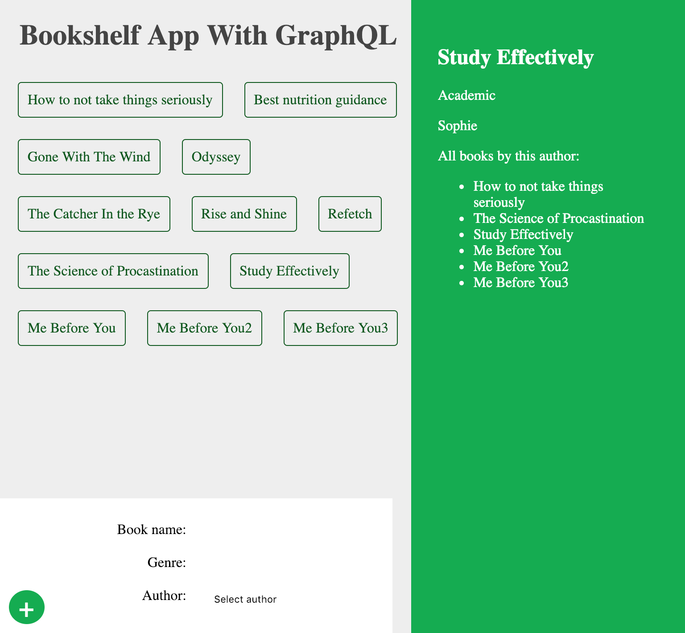

# graphql-playlist
All course files for the GraphQL tutorial playlist on The Net Ninja YouTube channel.

### How to start application
* `npm install` for both client and server folder
* Server: `npm i nodemon', then start the server with `nodemon app.js`
* Client: `npm start`

### Screenshot

